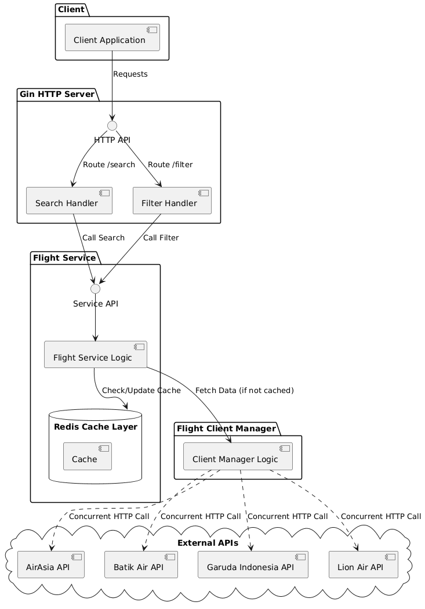

# Travel Flight API

A Go-based flight aggregation service that searches multiple airline providers concurrently and provides filtering/sorting capabilities.

## Table of Contents

- [Overview](#overview)
- [Running the Application](#running-the-application)
- [Architecture](#architecture)
- [Key Design Decisions](#key-design-decisions)
- [Prerequisites](#prerequisites)
- [Installation](#installation)
- [Configuration](#configuration)

## Running
Prerequisites : Need Docker to be installed

```bash
git clone <repository-url>
cd travel

# automates checking for docker installation, copying .env.example, build docker image, start server, detailed on (dev-setup.sh)
make dev-setup
```

## Overview

This service aggregates flight search results from multiple airline providers (AirAsia, Batik Air, Garuda Indonesia, Lion Air) and provides:

- **Concurrent API calls** to multiple providers for fast results
- **Redis caching** to reduce API calls and improve response times
- **Flexible filtering and sorting** on cached results
- **Partial result handling** when some providers fail
- **Swagger/OpenAPI documentation** for easy API exploration

## Architecture


## Key Design Decisions

### 1. Concurrent Provider Queries
Query all 4 airline providers simultaneously using goroutines.

**Reason**: Minimizes total search time (limited by slowest provider, not sum of all)

**Trade-off**: Higher resource usage (4 concurrent HTTP connections per search)


### 2. Partial Results Strategy
Return results even if some providers fail (timeout/error).

**Reason**:
- Assuming providers are independent companies; one failure shouldn't block the entire search
- Users still get value from available results

**Trade-off**: Users may not see all available flights if providers fail.

### 3. Cache Key Strategy
Cache results based on `(origin, destination, departure_date, passengers, cabin_class)`.

**Reason**:
- Airline APIs return different results for different passenger counts and cabin classes
- Each unique search combination must have its own cache entry
- Ensures users always get accurate prices and availability

**Trade-off**: Less cache reuse (more unique keys), but ensures data correctness.

### 4. Filter/Sort on Cached Data

#### A. Filtering
- **Pre-computation:** Parse time strings (e.g., `"14:00"`) into `seconds-from-midnight` integers once per request.  
- **FilterContext:** Build a `FilterContext` struct that contains all precomputed values and derived state used by predicates.  
- **Short-circuiting / Fail-fast:** Iterate results and apply predicates in an order that fails fast (cheap checks like Price first). If a flight fails a predicate, skip remaining checks for that item.

#### B. Sorting (Stable Sort)
Use Go's `sort.SliceStable` instead of `sort.Slice` because stable sort preserves relative order for equal-key elements (prevents flights with equal price from "jumping" positions on refresh).

#### C. "Best Value" Scoring Algorithm
The "Best Value" sort computes score per flight using **Weighted Normalization** to bring disparate metrics onto a `0.0 .. 1.0` scale.

**Normalization (per metric):**

```
NormalizedScore = 1.0 - (Value - Min) / (Max - Min)
```

- Result: the best value (cheapest / fastest) → `1.0`; worst → `0.0`.

**Weights (example):**
- Price: `0.45`  
- Duration: `0.35`  
- Stops: `0.20`

**Final score formula:**

```text
FinalScore = (0.45 * NormPrice) + (0.35 * NormDuration) + (0.20 * NormStops)
```

**Ranking:** Sort results by `FinalScore` **descending**.


### 5. Flexible Time Parsing

**Decision**: Handle multiple time formats from different providers in the client layer.

**Reason**:
- Each airline API uses different datetime formats:
  - AirAsia: RFC3339 (`2006-01-02T15:04:05Z07:00`)
  - Batik Air: `2006-01-02T15:04:05-0700`
  - Lion Air: `2006-01-02T15:04:05` (no timezone)
  - Garuda: RFC3339
- Centralizing parsing logic simplifies provider-specific clients

**Implementation**:
```go
type FlexibleTime struct {
    time.Time
}

func (ft *FlexibleTime) UnmarshalJSON(b []byte) error {
    // Tries multiple formats in order
}
```

**Trade-off**: Slightly more complex unmarshaling, but better maintainability.
